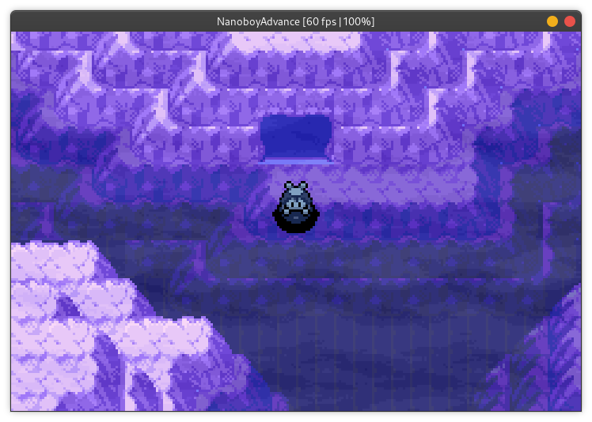

<h2>NanoboyAdvance</h2>


[](https://www.codefactor.io/repository/github/fleroviux/NanoboyAdvance)

NanoboyAdvance is a Nintendo GameBoy Advance (TM) emulator written in C++17.<br>
The goal is to create a modern, accurate GameBoy Advance emulator while also being fast
and avoiding to sacrifice too much code quality.

The emulator implements the core hardware completely and with high accuracy.
Any game that I tested so far goes in-game in NanoboyAdvance, almost all of them without known issues.
The games from the `Classic NES` series, which are troublesome to emulate and abuse a variety of edge-cases and undefined behaviour, are emulated properly. 

## Media



## Compiling

NanoboyAdvance works and can be compiled on Windows, Linux and Mac OS X.
A C++17 capable C++ compiler is required. G++7 / Clang++6 or newer are recommended.
Other compilers may work, but are untested.

In order to compile NanoboyAdvance you will need a few dependencies:
- CMake
- SDL2 development files (libsdl2-dev on a Debian-based system)

### Setup

Download or clone the repository to a folder of your choice.
Then open a command prompt, create a build folder, run `cmake` and `make` to build the emulator.
```bash
cd /your/path/NanoboyAdvance
mkdir build
cd build
cmake ..
make
```

If you get an error regarding to `libc++fs` not being found, try commenting out `target_link_libraries(gba stdc++fs)` in `source/gba/CMakeLists.txt`.

The compiled executable can be found at `build/source/platform/sdl/`.

### Rebuilding

When rebuilding you can just re-run make from the command prompt.
```bash
cd /your/path/NanoboyAdvance/build
make
```

## Running

In order to run NanoboyAdvance you will need a BIOS file.
You can either dump your own or get an open source replacement online (https://github.com/Nebuleon/ReGBA/blob/master/bios/gba_bios.bin).
The BIOS file must be placed as `bios.bin` in the same folder as the executable.

You can then run the emulator:
```bash
./NanoboyAdvance-SDL path_to_your_rom.gba
```

## Limitations
- currently there is no configuration system.
- no link-cable.
- some of the code is not endian-safe.

## Acknowledgement

- GBATEK by Martin Korth: a great piece of documentation that made this emulator possible.
- mGBA by endrift: great test suite, also referenced its code for a few details.
- VisualBoyAdvance by Forgotten: inspired me to pursue emulator programming.
